# 사용자 가이드

> 대상: 메신저를 사용하는 직원.
> 이 문서는 초안입니다 — 실제 배포된 앱 이름·다운로드 링크·서버 주소로 채워 넣어 주세요.
> 구성·서술 방식은 [Bizbox Alpha 메신저 사용자 매뉴얼](https://manual.bizboxa.com/user/ko/messenger)을 참고했습니다.
> 화면 캡처는 개발 환경에서 촬영했으며, 실제 조직도·채팅 상대의 이름·이메일·연락처는 모두 모자이크(블러) 처리했습니다.

## 1. 메신저 설치 및 제거

### 설치하기

1. 회사에서 안내한 다운로드 링크에 접속하세요.
2. **Mac**: `.dmg` 파일을 다운로드한 후 열어서 앱을 **Applications** 폴더로 드래그하세요.
3. **Windows**: `Setup .exe` 파일을 다운로드한 후 실행해서 설치하세요. (일반 PC는 x64용, Surface 등 Windows on ARM 기기는 arm64용)
4. 설치가 끝나면 바탕화면(또는 시작 메뉴/런치패드)에 앱 아이콘이 생성됩니다.

> **참고**
> macOS에서 앱 실행 시 **"손상되었기 때문에 열 수 없습니다"** 라는 경고가 나타날 수 있습니다. 앱 서명 절차가 아직 적용되지 않아 나타나는 정상적인 경고이며, 아래 순서로 해결할 수 있습니다.
> 1. **터미널** 앱을 여세요.
> 2. 아래 명령을 입력한 후 Enter를 누르세요. (앱 이름은 실제 설치된 이름으로 변경)
>    ```bash
>    xattr -cr /Applications/앱이름.app
>    ```
> 3. 앱을 다시 실행하세요.
>
> 문제가 계속되면 관리자에게 문의하세요.

### 제거하기

- **Mac**: **Applications** 폴더에서 앱을 휴지통으로 드래그하세요.
- **Windows**: **설정 → 앱 → 앱 및 기능**(또는 **제어판 → 프로그램 및 기능**)에서 앱을 찾아 **제거**를 클릭하세요.

## 2. 로그인 및 로그아웃

메신저에 로그인하고 로그아웃하는 방법은 다음과 같습니다.

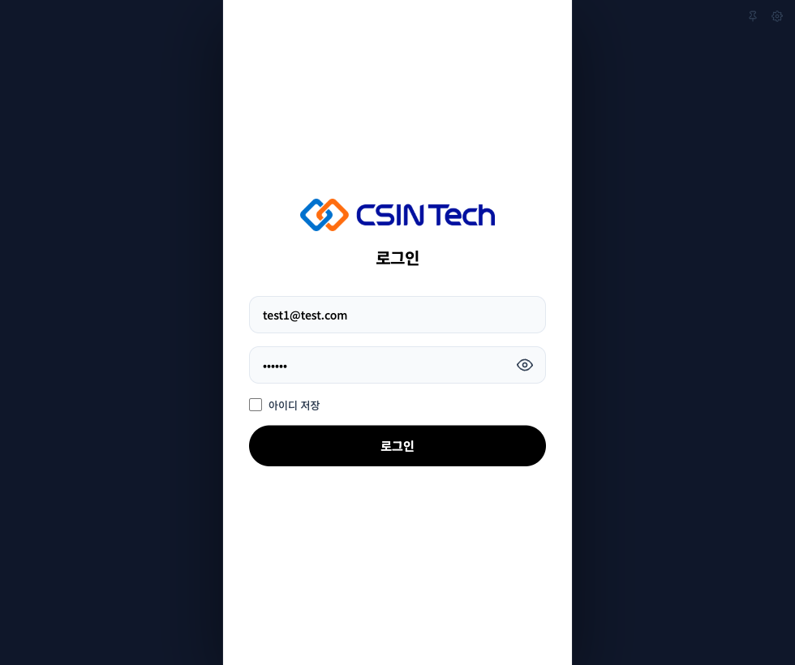

1. 앱 아이콘을 더블클릭하세요. 로그인 화면이 나타납니다.
2. **아이디 또는 이메일**과 **비밀번호**를 입력한 후 **로그인** 버튼을 클릭하세요.
   - **[아이디 저장]**: 체크하면 다음 실행 시 입력한 아이디가 자동으로 채워집니다.
   - 로그인 화면 우측 상단의 **설정(톱니바퀴)** 아이콘을 클릭하면 접속할 **서버 주소**를 직접 지정할 수 있습니다. (평소에는 입력할 필요 없음 — 서버 연결 오류가 날 때만 관리자 안내에 따라 확인)
   - **핀 고정** 아이콘으로 로그인 창을 항상 위에 고정할 수 있습니다.
3. 최초 로그인 시 비밀번호 변경을 요구하는 경우, 안내에 따라 새 비밀번호로 변경하세요.

> **참고**
> 비밀번호를 잊었다면 관리자에게 초기화를 요청하세요.

### 로그아웃 / 잠그기 / 종료

메인 화면 좌측 하단의 **내 프로필**을 클릭하면 아래 메뉴를 사용할 수 있습니다.

- **상태 설정**: 접속 상태를 변경합니다 (§4 참고)
- **겸직 부서 전환**: 겸직 중인 경우, 표시할 소속 부서를 전환합니다
- **잠그기**: 자리를 비울 때 메신저를 잠금 상태로 전환합니다 (다시 사용하려면 비밀번호 입력)
- **로그아웃**: 계정에서 로그아웃하고 로그인 화면으로 돌아갑니다
- **종료**: 메신저 앱을 완전히 종료합니다

## 3. 메신저 홈 화면 구성

로그인하면 나타나는 메인 화면은 아래와 같이 구성됩니다.

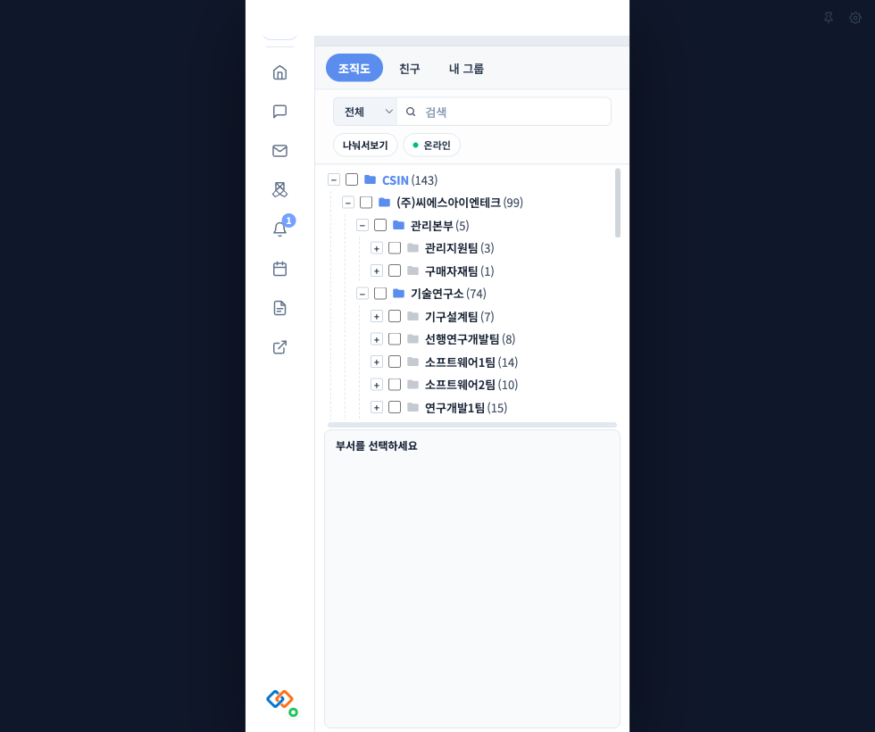

| 영역 | 설명 |
|------|------|
| **좌측 사이드바** | 조직도 / 대화 / 메일(그룹웨어 바로가기) / 쪽지 / 알림 / 일정 / 메모장 / 외부 링크 아이콘 |
| **좌측 하단 프로필** | 내 이름·상태 아이콘. 클릭하면 상태 변경, 겸직 부서 전환, 잠그기, 로그아웃, 종료 메뉴가 나타남 |
| **본문 영역** | 선택한 메뉴에 따라 조직도, 채팅방 목록, 알림 목록 등이 나타남 |

## 4. 상태 설정하기

내 접속 상태를 다른 사람에게 보여줄 수 있습니다.

1. 좌측 하단 **내 프로필**(또는 **설정** 패널)을 클릭하세요.
2. 원하는 상태를 선택하세요.
   - **온라인**
   - **자리 비움**
   - **다른 용무 중**
   - **회의 중**
   - **외근 중**
3. 선택한 상태 아이콘이 조직도·대화방에서 내 이름 옆에 표시됩니다.

## 5. 조직도 사용하기

부서 및 구성원 정보를 검색·확인하고, 쪽지·대화·메일 등 다양한 기능을 바로 사용할 수 있습니다.

1. 사이드바에서 **조직도**를 클릭하세요. 조직도가 나타납니다.
2. 상단 탭에서 **조직도** / **친구** / **내 그룹** 중 원하는 보기를 선택하세요.
3. 부서를 클릭해 펼치거나 접어 구성원을 찾으세요. 부서를 클릭하면 하단에 그 부서 소속 구성원 목록이 나타납니다.

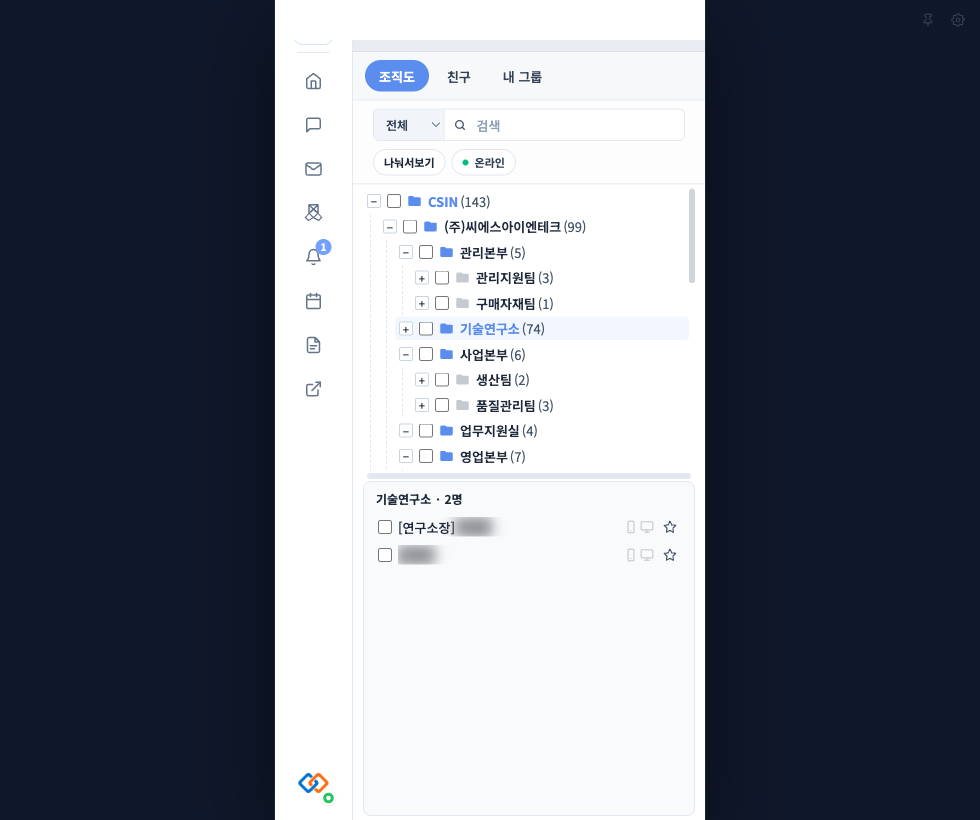

   - 구성원의 이름을 **더블클릭**하면 바로 대화방이 열립니다.
   - 구성원의 이름을 **우클릭**하면 프로필 보기 / 쪽지 보내기 / 즐겨찾기(친구) 추가·해제 / 메일 보내기 / 내 그룹에 추가 메뉴가 나타납니다. 체크박스로 여러 명을 선택하면 한 번에 쪽지·메일을 보내거나 내 그룹에 추가할 수 있습니다.
   - 이름 옆 PC/모바일 아이콘으로 접속 기기를 확인할 수 있습니다.
   - 이름 옆 별 아이콘을 클릭하면 **친구(즐겨찾기)** 로 등록/해제됩니다.

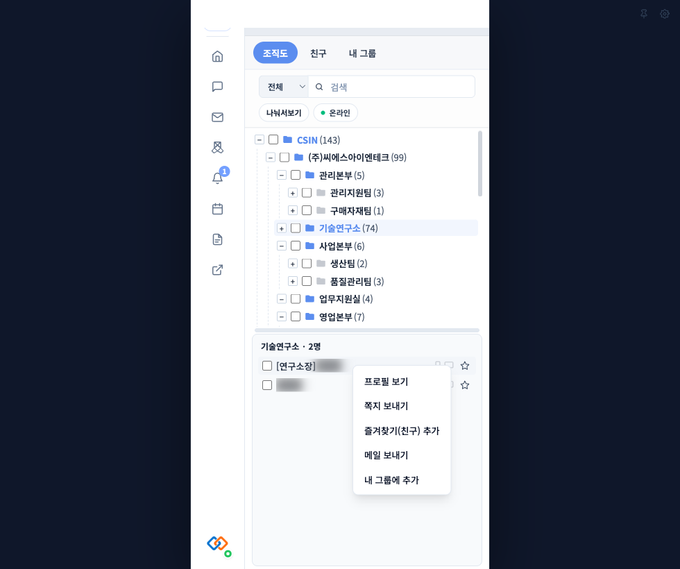

> **참고**
> **온라인**을 켜면 부서 구조 대신, 현재 접속 중인 사람만 평평한 목록으로 볼 수 있습니다. 매칭되는 사람이 없는 부서는 자동으로 목록에서 숨겨집니다.

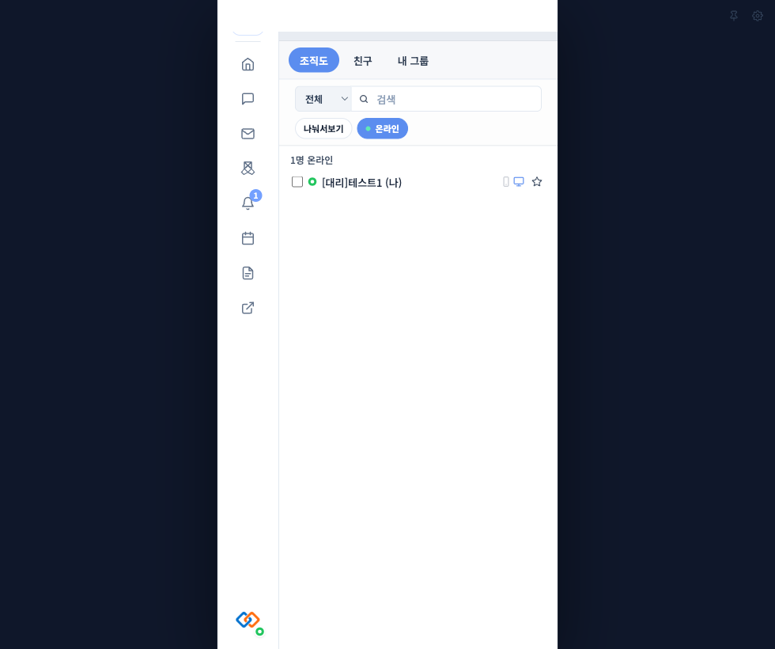

### 사용자 검색하기

1. 검색창 옆 드롭다운에서 검색 조건(전체 / 이름 / 부서 / 업무 / 메일 / 내선 / 휴대폰)을 선택하세요.
2. 검색어를 입력하세요. 조건에 맞는 구성원이 하이라이트되어 표시됩니다.

### 친구(즐겨찾기) · 내 그룹 사용하기

자주 연락하는 구성원을 즐겨찾기하거나 그룹으로 묶어 관리할 수 있습니다.

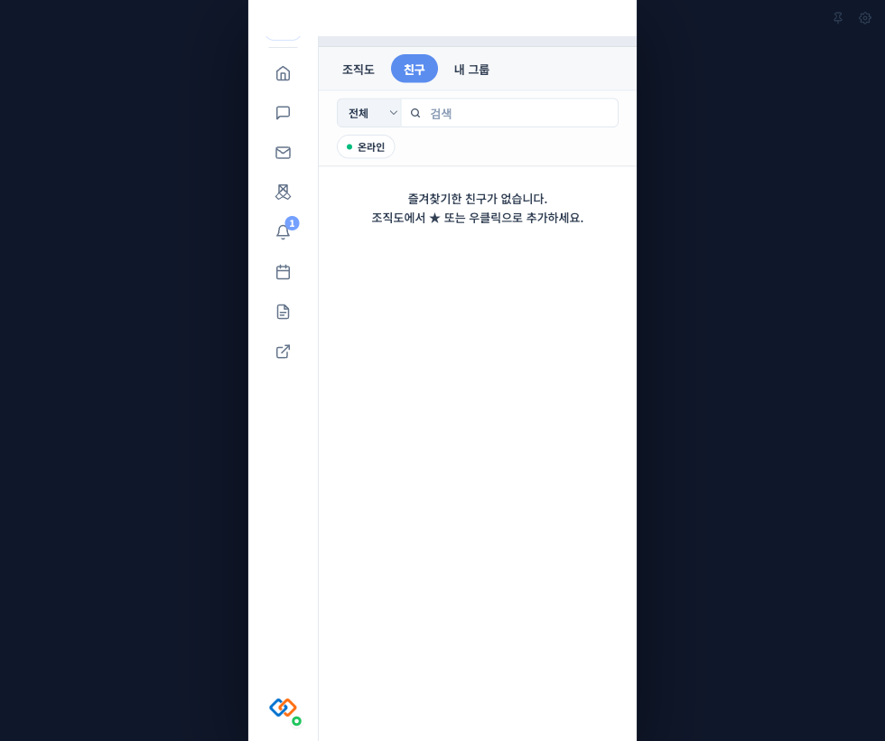

1. 조직도에서 구성원 이름 옆 별 아이콘을 클릭하거나, 우클릭 메뉴에서 **즐겨찾기(친구) 추가**를 클릭하면 **친구** 탭에 추가됩니다.
2. 여러 명을 묶어 관리하려면 우클릭 메뉴의 **내 그룹에 추가**를 사용하세요. **내 그룹** 탭에서 그룹별로 구성원을 확인할 수 있습니다.

## 6. 대화(채팅) 사용하기

메신저의 대화방으로 구성원과 실시간으로 소통합니다.

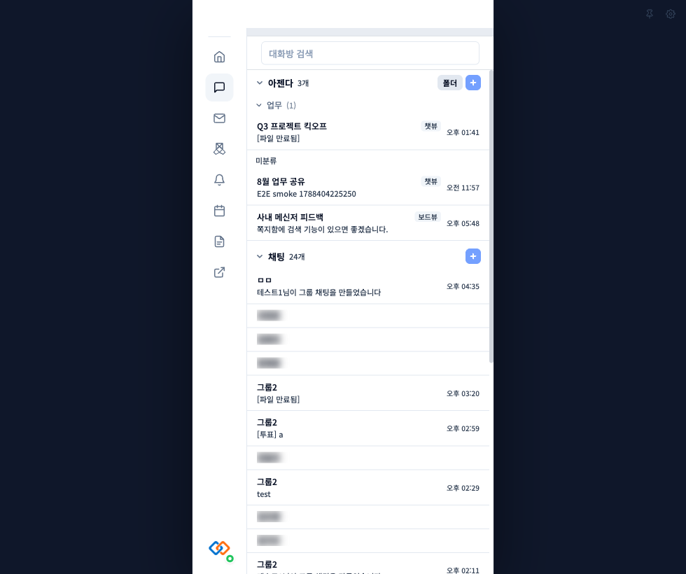

### 새 채팅 시작하기

- 조직도에서 상대 이름을 **더블클릭**하면 1:1 채팅방이 바로 열립니다.
- 여러 명과 그룹 채팅을 시작하려면, **대화** 탭의 **+** 버튼을 클릭하고 조직도에서 상대를 선택한 후 채팅을 시작하세요.

### 대화하기

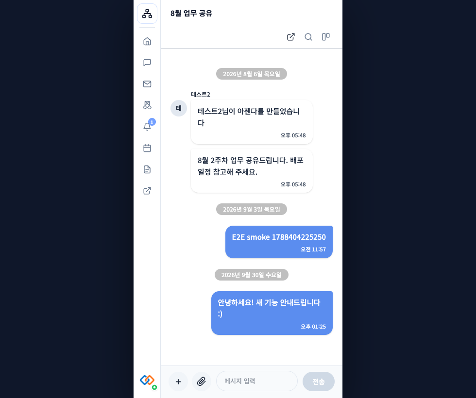

1. 채팅방을 열고 입력창에 내용을 입력한 후 **전송**을 클릭하세요.
2. 채팅창에서 아래 기능을 사용할 수 있습니다.
   - **파일 전송**: 파일 첨부 버튼을 클릭하거나, 원하는 파일을 채팅창으로 드래그하면 바로 전송됩니다.
   - **멘션**: 입력창에 `@이름`을 입력하면 해당 구성원을 강조 표시할 수 있고, 상대방의 **알림 → 멘션** 탭에 표시됩니다.
   - **채팅방 검색**: 채팅방 목록에서 검색어로 원하는 채팅방을 찾을 수 있습니다.

### 채팅방 관리하기

채팅방을 목록에서 **우클릭**하면 아래 기능을 사용할 수 있습니다.

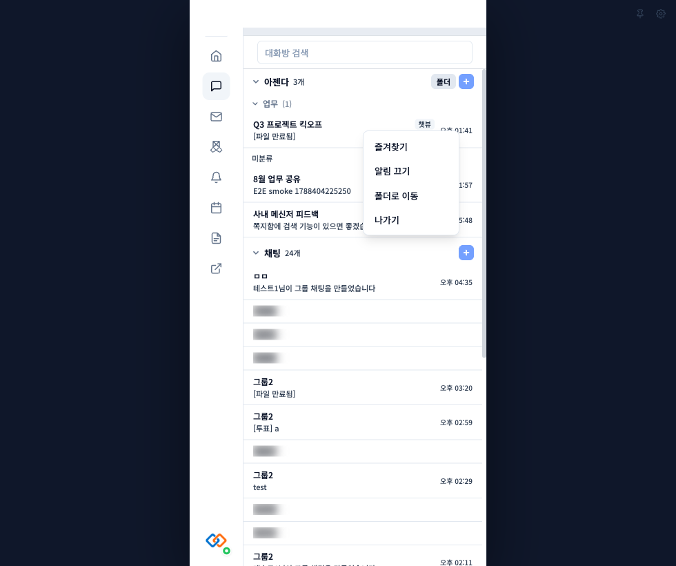

- **즐겨찾기 / 즐겨찾기 해제**: 자주 쓰는 채팅방을 즐겨찾기로 표시합니다.
- **알림 끄기 / 알림 켜기**: 해당 채팅방의 알림 여부를 설정합니다.
- **폴더로 이동**: 채팅방을 원하는 폴더로 분류합니다.
- **나가기**: 채팅방에서 나갑니다.

> **참고**
> 1:1 채팅방을 나가면 대화 내용이 삭제됩니다. 그룹 채팅방은 목록에서 숨김 처리되며, 다시 초대되면 이전 대화 중 본인이 참여했던 내용만 확인할 수 있습니다.

## 7. 알림 확인하기 (멘션 · 공지)

사이드바의 **알림**을 클릭하면 **멘션**과 **공지** 두 탭으로 확인할 수 있습니다.

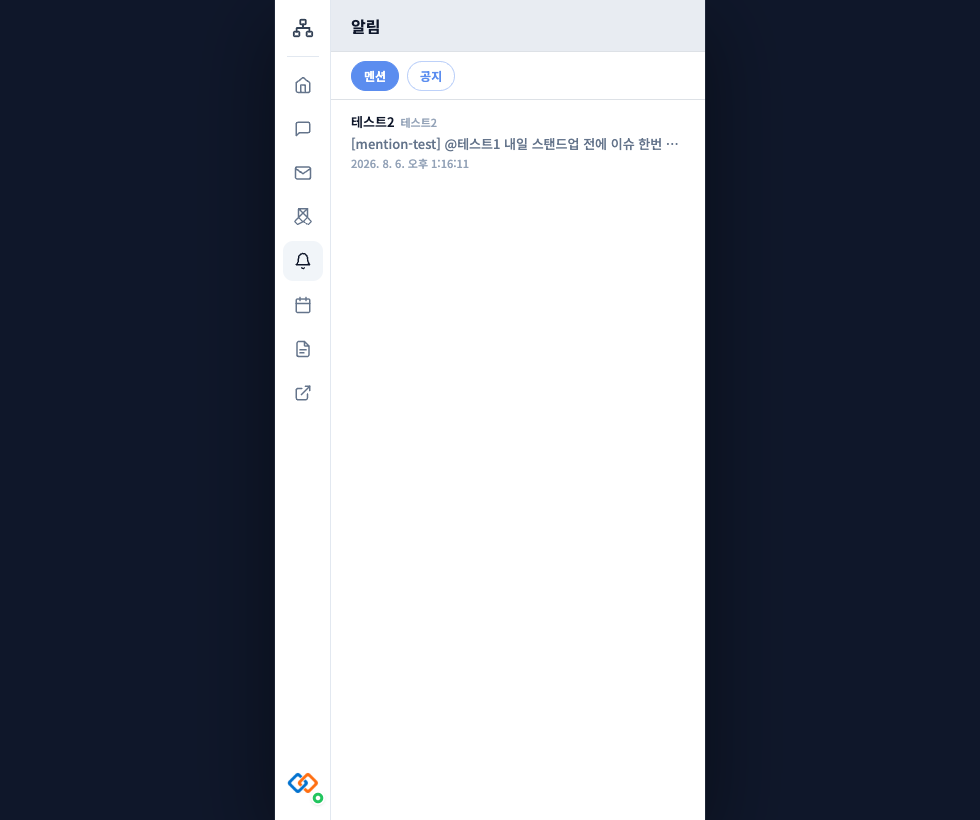

- **멘션 탭**: 다른 사람이 채팅에서 `@내이름`으로 나를 멘션한 메시지를 모아 볼 수 있습니다.
- **공지 탭**: 관리자가 등록한 전체 공지를 확인할 수 있습니다. 공지 등록은 관리자 권한이 있는 계정만 가능합니다.

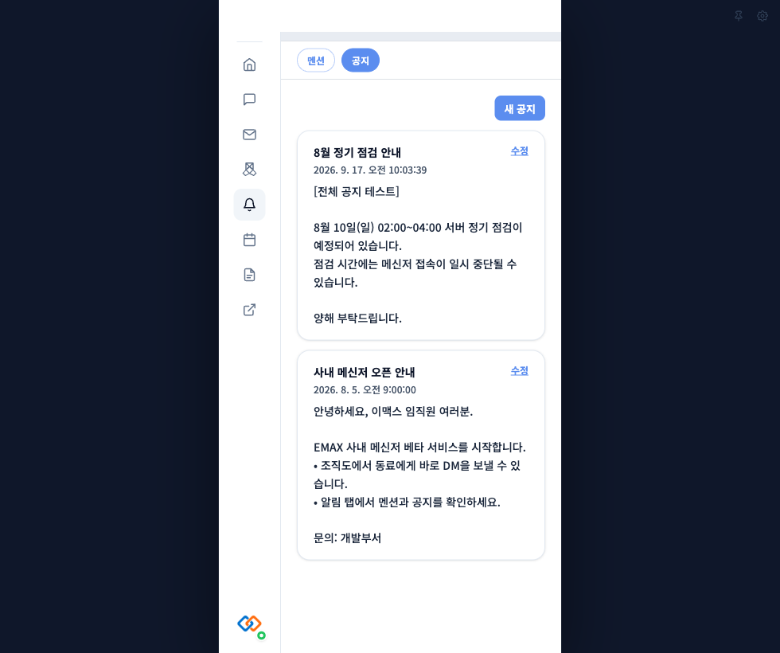

안 읽은 멘션·알림이 있으면 사이드바 아이콘에 숫자 배지가 표시되고, 데스크톱 알림으로도 안내됩니다.

> **참고**
> **Mac에서 데스크톱 알림이 뜨지 않을 때**: 시스템 설정 → 알림 → 개발 실행 시 "Electron", 설치된 앱은 앱 이름을 찾아 **알림 허용**을 켜세요. **설정** 패널의 **알림 테스트** 버튼으로 정상 동작 여부를 확인할 수 있습니다.

## 8. 쪽지 사용하기

다른 구성원에게 짧은 메시지(쪽지)를 보낼 때 사용합니다. 채팅방과 달리 대화 이력이 남지 않는 개별 메시지입니다.

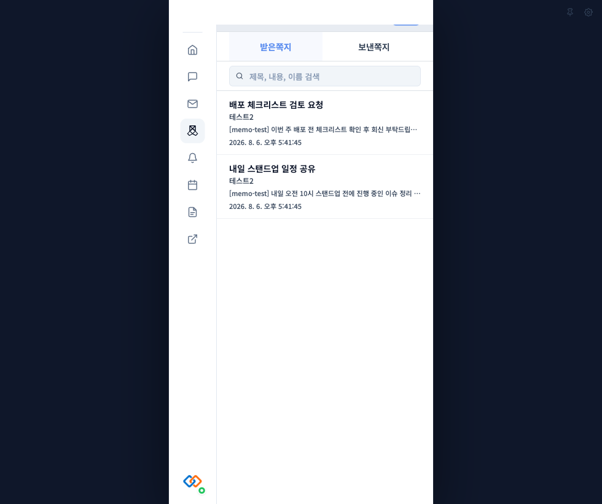

### 쪽지 보내기

1. 사이드바에서 **쪽지**를 클릭하면 **받은쪽지함** / **보낸쪽지함** 탭이 나타납니다.
2. 새 쪽지를 작성하려면 조직도에서 구성원을 우클릭한 후 **쪽지 보내기**를 클릭하세요. 받는 사람이 자동으로 입력된 작성창이 열립니다.
3. 내용을 입력한 후 보내기를 클릭하세요.

### 쪽지 확인 및 검색하기

- 검색창(제목, 내용, 이름 검색)으로 과거 쪽지를 찾을 수 있습니다.
- 쪽지를 클릭하면 내용을 확인할 수 있습니다.

## 9. 일정 사용하기

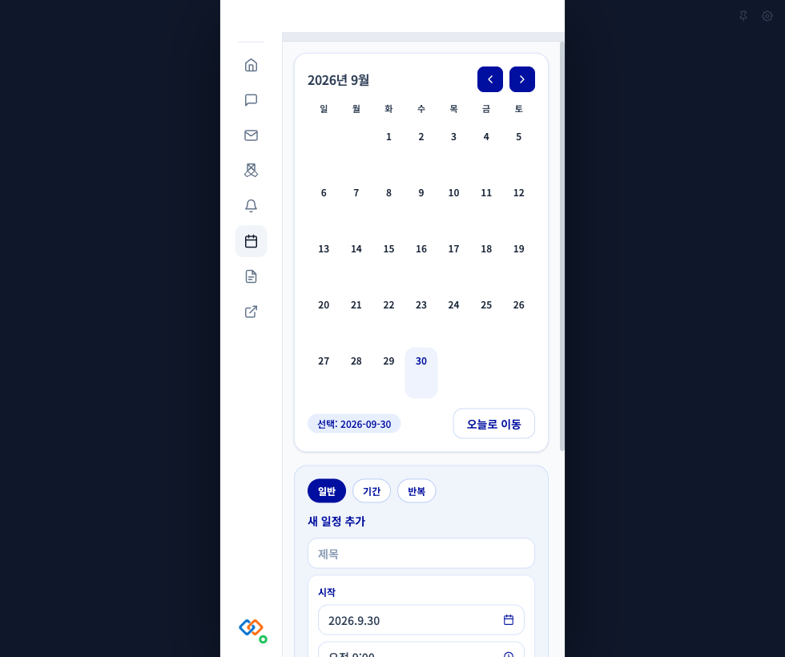

1. 사이드바에서 **일정**을 클릭하세요.
2. 캘린더에서 이전 달/다음 달 버튼(◀ ▶)으로 원하는 날짜로 이동하세요.
3. **일반 / 기간 / 반복** 중 유형을 선택하고, 제목과 시작 일시를 입력해 새 일정을 추가하세요.

## 10. 메모장 사용하기


**메모장**은 나만 볼 수 있는 개인 메모입니다. 다른 사람에게 공유되지 않으며, 입력 중 자동으로 저장됩니다 (저장 중… / 저장됨 / 저장 실패 상태가 표시됩니다).

## 11. 환경설정

**내 프로필** 메뉴 또는 (Mac/Windows 앱의) 타이틀바 **설정(톱니바퀴)** 아이콘을 클릭하면 설정 패널이 열립니다.

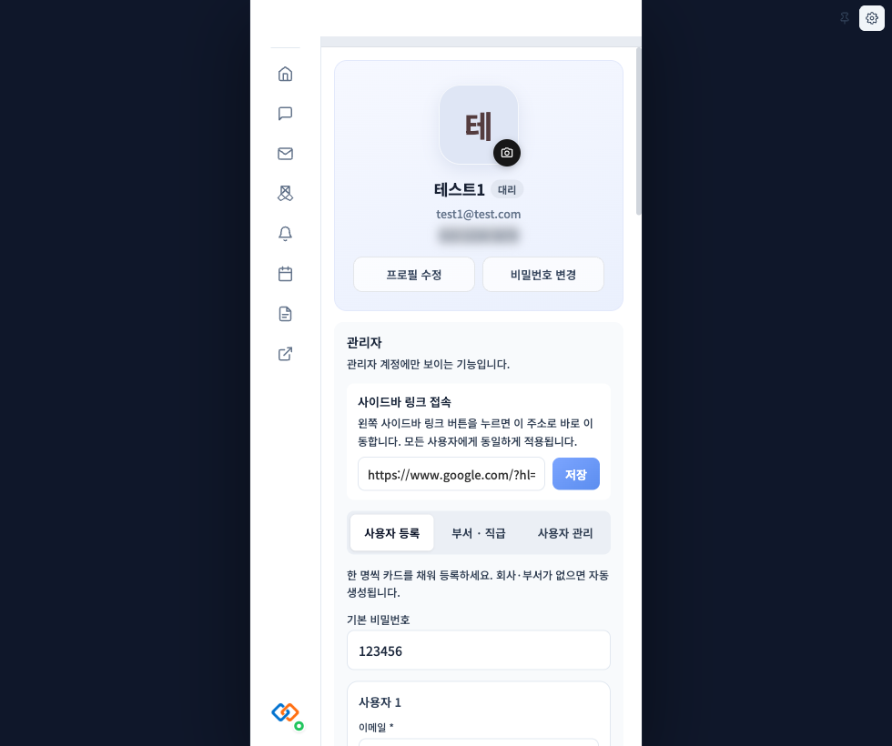

- **프로필 수정**: 휴대전화, 자리 전화번호, 내선번호를 수정합니다.
- **비밀번호 변경**
- **화면 테마**: 기본(파란색)을 포함해 세이지 그린·더스트 블루·유칼립투스 틸 등 여러 색상 테마 중 선택할 수 있습니다.
- **자리비움 표시 시간**, **알림 테스트**, **로그아웃**, **프로그램 종료**

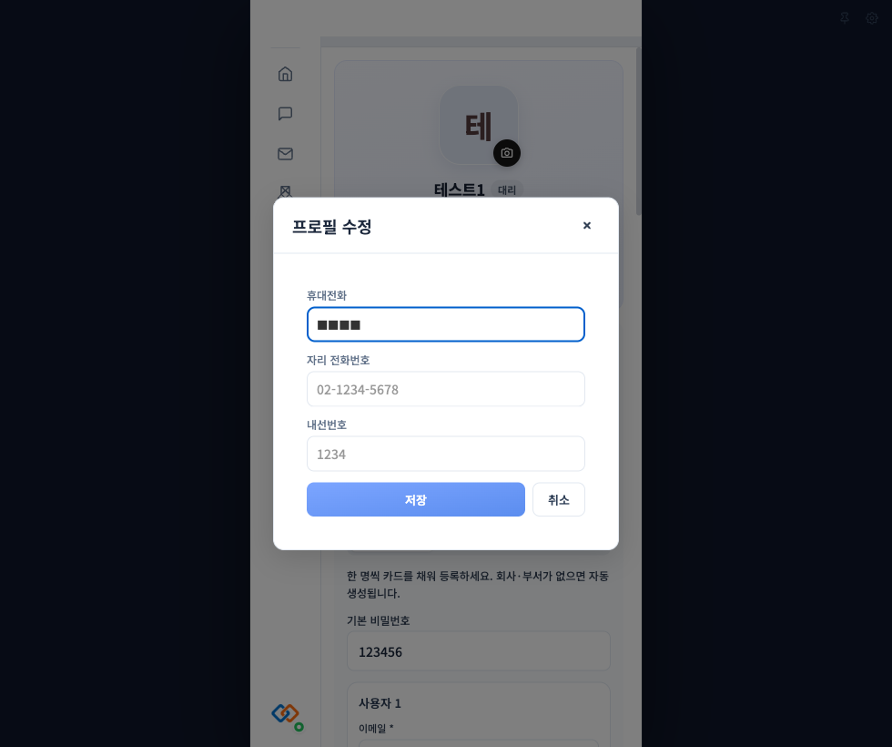

## 12. 조직/계정 관리하기 (관리자 전용)

관리자 권한이 있는 계정은 설정 패널 안에 **관리자** 영역이 추가로 나타나며, 아래 세 탭으로 구성됩니다.

- **사용자 등록**: 한 명씩 카드를 채워 계정을 일괄 등록합니다. 등록 시 사용할 기본 비밀번호를 지정할 수 있고, 회사·부서가 없으면 자동 생성됩니다.
- **부서 · 직급**: 회사·부서 목록을 관리합니다(추가/이름 변경/상위 부서로 이동/순서 변경/삭제). 여기서 정리한 부서명이 사용자 등록의 추천 목록에 그대로 쓰입니다.

  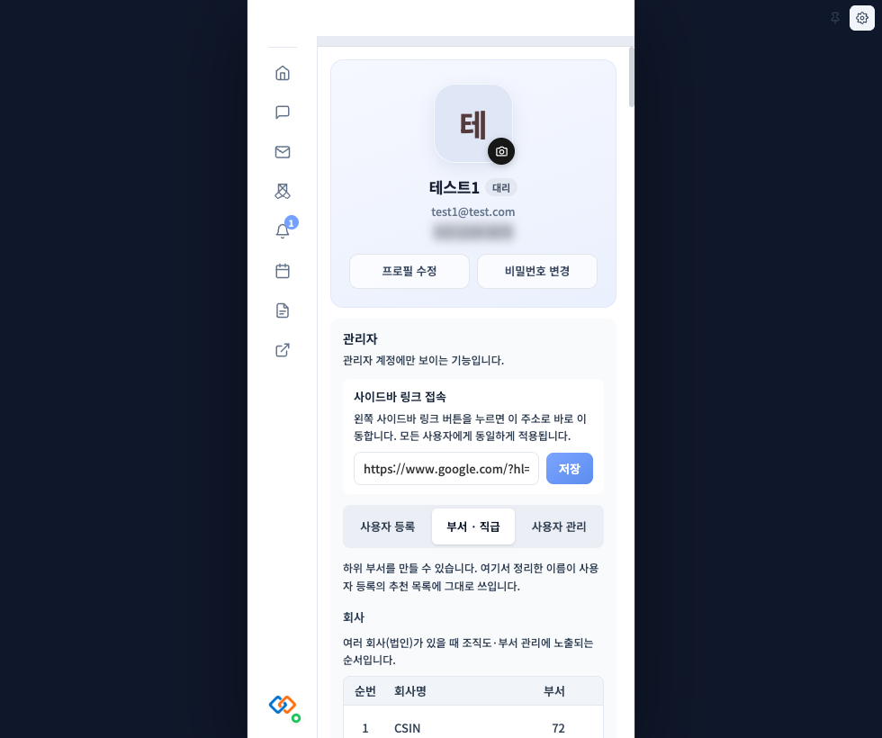

- **사용자 관리**: 조직도 트리에서 사용자를 골라 직급 지정, 비밀번호 초기화, 삭제를 합니다.

  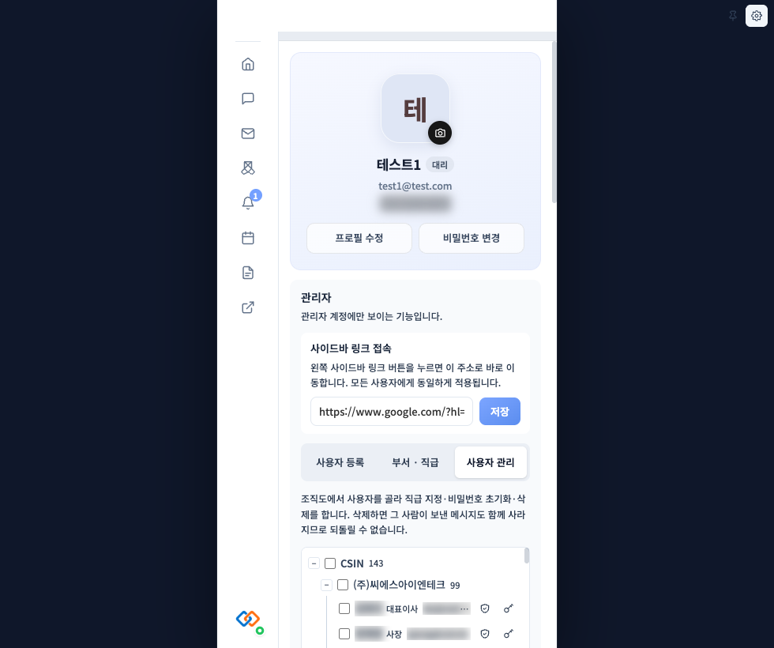

  > **참고**
  > 사용자를 삭제하면 그 사람이 보낸 메시지도 함께 사라지며 되돌릴 수 없습니다.

- 이 외에도 관리자는 좌측 사이드바의 **외부 링크** 아이콘이 이동할 주소를 여기서 지정할 수 있습니다(모든 사용자에게 동일하게 적용).

## 13. 자주 묻는 질문 (FAQ)

**Q. 로그인이 안 돼요.**
A. 아이디/비밀번호를 다시 확인하고, 그래도 안 되면 관리자에게 계정 상태 확인을 요청하세요.

**Q. 채팅 목록이 "목록을 불러올 수 없습니다"라고 나와요.**
A. 서버 연결 문제일 수 있습니다. 인터넷 연결을 확인하고, 계속되면 관리자에게 문의하세요.

**Q. 알림이 안 와요.**
A. Mac은 시스템 알림 권한을 확인하세요 (§7). Windows는 앱 내 알림 설정과 시스템 알림 설정을 확인하세요.

**Q. 앱이 최신 버전으로 안 바뀌어요.**
A. 앱을 완전히 종료했다가 다시 실행해 보세요. 실행 중 백그라운드로 새 버전을 받아 두었다가, 재시작 시 적용됩니다. 메뉴 **도움말 → 업데이트 확인**으로 수동 확인도 가능합니다.

**Q. 비밀번호를 잊어버렸어요.**
A. 관리자에게 비밀번호 초기화를 요청하세요.

**Q. 조직도에서 특정 부서에 아무도 안 보여요.**
A. **온라인** 필터가 켜져 있으면 접속 중인 사람이 없는 부서는 목록에서 숨겨집니다. 꺼서 전체 조직도를 확인하세요.

## 14. 문의처

문제가 해결되지 않으면 회사 IT 담당자(또는 관리자)에게 문의하세요.

---
*이 문서는 초안입니다. 실제 다운로드 링크, 서버 주소, 담당자 연락처 등을 채워 배포용으로 다듬어 주세요.*
